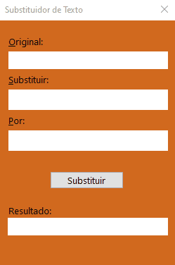

# Manual String Replacement in Delphi 
### Sobre o projeto 

Este projeto implementa manualmente um algoritmo para substituição de substrings em uma string, utilizando Delphi e interfaces. 

O objetivo do projeto é demonstrar a lógica de programação e manipulação de strings sem utilizar funções prontas da linguagem, como: 

StringReplace,  Pos, Copy, Delete, Insert, Toda a lógica de busca e montagem da nova string foi implementada manualmente. 

 

## Conceitos aplicados 

- Interfaces em Delphi 
- Manipulação manual de strings 
- Lógica de busca de substrings 
- Construção dinâmica de strings 

 

## Estrutura da solução 

A solução utiliza uma classe concreta. 

Classe 

A classe TSubstitui implementa a interface ISubstitui e contém toda a lógica responsável por: 

Percorrer a string original 

Encontrar a substring desejada 

Substituir pela nova substring 

Construir a nova string resultante 

 

## Exemplo de execução 

Entrada: 
String: "O rato roeu a roupa do rei de roma" 
Velha: "ro" 
Nova: "teste" 

Saída esperada: 
"O rato testeeu a testeupa do rei de testema" 

## Exemplo de execução

 

## Restrição do exercício 

Para fins de avaliação de lógica de programação, não é permitido utilizar funções nativas de manipulação de strings do Delphi, como: 
- StringReplace 
- Pos 
- Copy 
- Delete 
- Insert 
- Toda a manipulação é feita manualmente. 

## Objetivo acadêmico 

Este projeto foi desenvolvido como exercício para demonstrar: 
- raciocínio lógico 
- entendimento de manipulação de strings 
- uso de interfaces 
- implementação manual de algoritmos 

## Autor 

Rick Santos 
Estudante de Análise e Desenvolvimento de Sistemas 
